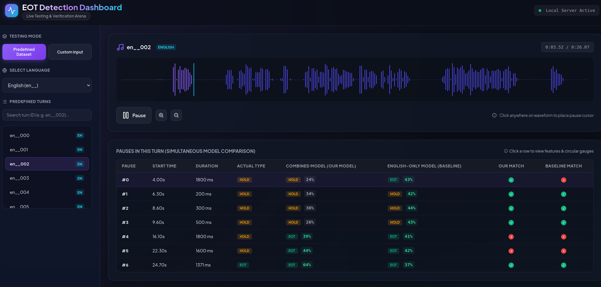

# EOT Detection Live Dashboard

An interactive, responsive single-page web dashboard and backend server to visualize, test, and compare End-of-Turn (EOT) detection models in real-time.

## Features

- **Predefined Dataset Browser**: Select turns from English and Hindi datasets, view their audio waveforms, and test individual pauses.
- **Model Comparison Arena**: Side-by-side comparison of:
  - **Combined Model** (`model.joblib` trained on English + Hindi)
  - **English-Only Model** (`model_en_only.joblib` trained on English only)
- **Live Causal Feature Analysis**: Visual dashboard displaying the 9 causally extracted prosodic features (pitch slope, energy decay, voicing density ratio, spectral stability, etc.).
- **Interactive Audio Waveform**: Play, pause, seek, and zoom the audio wave shape in real-time using Wavesurfer.js.
- **Direct Recording**: Speak directly into your microphone, capture your voice, and run live EOT analysis using our client-side PCM WAV encoder.
- **WAV Audio Upload**: Upload any custom WAV file and set custom pause positions to perform live inference.

## How to Run

Since we want to preserve the environment configured for training, you must run the server using the project's virtual environment.

### 1. Start the Flask Server

Run the server from the `Interface` directory using the active virtual environment:

```bash
/home/soham/speedrun/env/bin/python3 server.py
```

Or from the repository root:

```bash
/home/soham/speedrun/env/bin/python3 Interface/server.py
```

The server will load the models, thresholds, and start listening:
```
* Running on http://127.0.0.1:5000/ (Press CTRL+C to quit)
```

### 2. Open the Dashboard


Open your web browser and navigate to:
[http://127.0.0.1:5000/](http://127.0.0.1:5000/)

## Tech Stack

- **Backend**: Python Flask, NumPy, Scikit-Learn, Scipy, Soundfile, Joblib
- **Frontend**: Vanilla HTML5, CSS3, JavaScript (Plus Jakarta Sans, Outfit, Lucide Icons, Wavesurfer.js)
