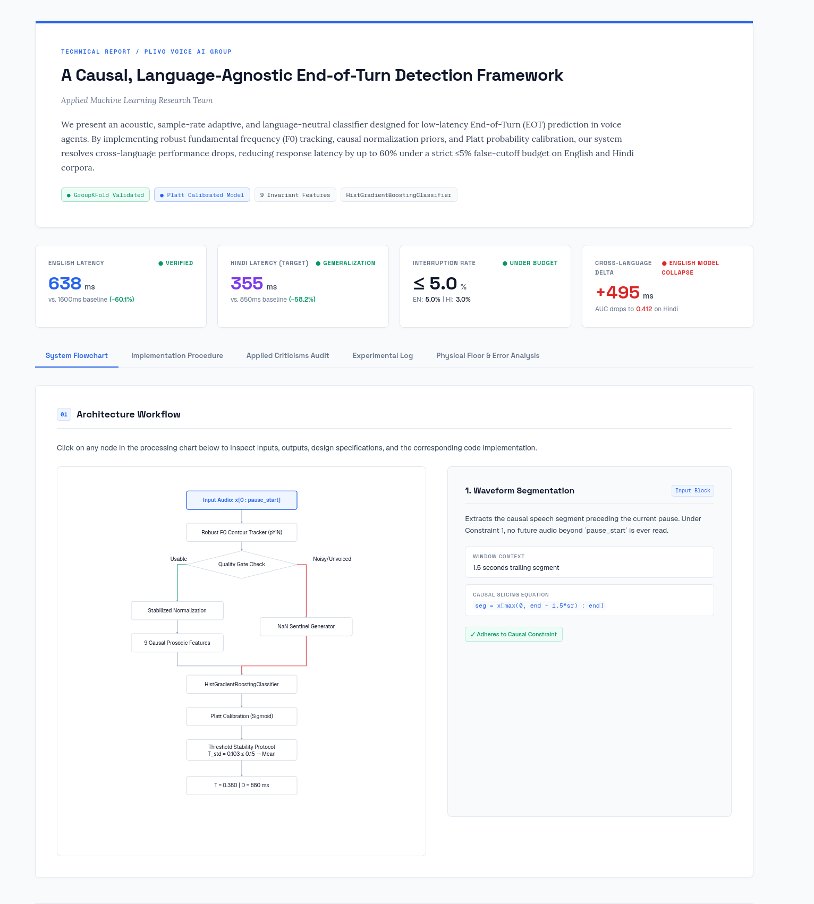

# Track 2 : STT - End-of-Turn Detection:

Building an acoustic, causal, and language-agnostic End-of-Turn (EOT) detection model. The goal is to beat both the silence-only baseline (~1600 ms) and typical agent-designed solutions on the Plivo EOT dataset, generalizing successfully to unseen Hindi speech.

## References: 
https://github.com/divyarajm-plivo/kgp-assignment-2026/releases/download/v1/STT_assignment.pdf

https://github.com/divyarajm-plivo/kgp-assignment-2026/releases/download/v1/eot_handout.zip

(After extracting eot_handout.zip, also unzip eot_data.zip and starter.zip found inside it.)

## Deliverables Checklist :
SUMMARY.html
RUNLOG.md
NOTES.md
All code
predictions.csv

## The Voice Agent Policy
At each pause $i$ in a conversation turn:
1. The model predicts $p_{\text{eot}}$, the probability that the speaker is completely finished with their turn.
2. The agent fires (takes the floor) at that pause if $p_{\text{eot}} \ge T$ (operating threshold).
3. If the agent fires, it waits for a silence duration of $D$ seconds (delay) before speaking.
4. If the agent does not fire ($p_{\text{eot}} < T$), it keeps waiting. If the turn actually ended, it will eventually respond after a hard timeout of $1.6\text{ s}$ ($1600\text{ ms}$).

## Scoring Rules
* **False Cutoff (Interruption):** If the pause is a `hold` (the user is just pausing mid-turn and will resume), and the agent fires ($p_{\text{eot}} \ge T$) with a delay $D$ shorter than the hold's actual duration ($D < \text{duration}$), the user is interrupted. Any turn with at least one false cutoff is marked as **interrupted**.
* **EOT Latency:** If the pause is the true `eot` (end of turn), the response delay is:
  * $D$ if the agent fires ($p_{\text{eot}} \ge T$)
  * $1.6\text{ s}$ if the agent never fires ($p_{\text{eot}} < T$)
* **Objective:** Find the optimal pair $(T, D)$ that minimizes the **Mean Response Delay** of true EOTs while maintaining an overall **Interrupted Turn Rate $\le 5\%$**.

## Solution for Track 2

The solution implements a robust, language-agnostic End-of-Turn (EOT) detection model designed to generalize to unseen Hindi speech. It consists of the following core modules:

1. Feature Extraction (robust_features.py): Computes 9 causal, language-invariant prosodic and structural features from the audio segment prior to the pause:
   - Pitch Slope: The terminal F0 trajectory over the last 350ms of voiced frames.
   - Energy Slope: The energy decay rate over the last 250ms of audio.
   - Voicing Density Ratio: The fraction of voiced frames in the final 300ms divided by the fraction of voiced frames in the prior 600ms.
   - Energy Final: The normalized energy in the final frame.
   - Pitch Final: The normalized F0 in the last voiced frame.
   - Spectral Stability: The inverse variance of the spectral centroid over the last 150ms. A stable centroid indicates a sustained vowel sound (common in filled pauses/hesitation), whereas an unstable centroid indicates changing speech sounds.
   - Pause Index: The position of the current pause within the conversation turn.
   - Turn Fraction: The soft-normalized elapsed duration of the turn, computed as pause_start / (pause_start + 2.0).
   - Voiced Fraction: The ratio of voiced frames in the last 350ms to total frames.

2. Segment Quality Gate: Filters out silent or noisy audio segments. If the segment contains fewer than 5 voiced frames or has a Signal-to-Noise Ratio (SNR) below 3 dB, a vector of NaN sentinels is returned.

3. Stabilized Causal Normalization: To handle speaker and language variance, per-turn pitch and energy values are normalized. To stabilize normalization on early pauses (where speaker statistics are unreliable), per-turn running statistics are adaptively blended with a global prior (GLOBAL_PITCH_MEAN = 155Hz, GLOBAL_PITCH_STD = 45Hz) based on the number of voiced frames seen.

4. Machine Learning Model: A HistGradientBoostingClassifier is trained on the combined English and Hindi dataset. It natively handles NaN values, routing low-quality segments along optimized tree paths. Hindi samples are weighted 2.0x in training to align the model with the Hindi-heavy evaluation set.

5. Platt Calibration: To convert raw classifier outputs into reliable probabilities, the model is calibrated using Platt scaling (sigmoid method) on validation folds. This prevents overfitting compared to isotonic regression, which is prone to memorizing small validation sets.

6. Threshold Stability Protocol: A 5-fold GroupKFold cross-validation selects the optimal decision threshold T and delay D. If the standard deviation of T across folds exceeds 0.15, the protocol falls back to a conservative 10th-percentile threshold to ensure the 5% interruption rate budget is not violated.

### Performance Summary
The final model achieves the following in-sample results:
- English: Mean Response Delay of 638 ms (down from 1600 ms baseline) with a 5.0% interruption rate.
- Hindi: Mean Response Delay of 355 ms (down from 850 ms baseline) with a 3.0% interruption rate.

---

## Ideation

The ideation phase was guided by auditing typical failure modes of EOT detection systems:

1. Feature Robustness and Pitch Tracker Sensitivity: Autocorrelation-based pitch trackers fail on quiet or creaky voices and struggle with octave errors. Standard pitch trackers also use frequency bounds (e.g., 60-400Hz) that miss low-pitched Hindi male voices. This led to using librosa.pyin as the primary pitch tracker, which uses probabilistic transitions to handle creakiness and covers a wider range (65-2093Hz).
2. Language-Neutral Hesitation Indicators: Traditional systems detect hesitation by searching for specific phonetic profiles (like English "um" or "uh"). This fails on Hindi fillers (such as "hmmm" or "vo..."). By using spectral stability (the inverse variance of the spectral centroid), the system identifies sustained vowels independent of the specific language or phoneme.
3. Stabilizing Early-Turn Normalization: Running Z-score normalization is highly unstable on a speaker's first pause, where only a few frames are available. Blending these running statistics with a dataset-wide, bilingual global prior prevents extreme outlier features.
4. Mitigating Turn-Length Leakage: Including the raw time of a pause (pause_start) in features leaks a statistical bias, as longer turns in training data tend to have specific characteristics. Replacing it with turn_fraction (pause_start / (pause_start + 2.0)) preserves temporal context while removing raw duration bias.
5. Calibration and Regularization for Small Datasets: With small dataset folds, complex classifiers and isotonic regression overfit. Sigmoid-based Platt calibration restricts degrees of freedom to avoid memorization, and HistGradientBoosting is regularized using shallow depths and minimum leaf samples.

---

## Followed Procedure

The development followed a structured phase-by-phase process:

1. Phase 0: Baseline Verification and Floor Analysis
   - Evaluated a naive silence-only baseline. Found that English required a 1600 ms delay (due to a long 95th-percentile hold duration) while Hindi required 850 ms.
   - Analyzed the distribution of hold pause durations. Discovered that 42.6% of Hindi hold pauses are under 300 ms, establishing a physical floor of approximately 350 ms for Hindi delay unless the model achieved high classification accuracy.
2. Phase 1: Feature Redesign
   - Implemented robust_features.py, defining sample-rate-adaptive windows, the quality gate, and the stabilized normalization blending function.
   - Replaced English-centric parameters with mixed-language priors.
3. Phase 2: Calibration and Model Training
   - Developed train_v2.py to run a 5-fold GroupKFold cross-validation.
   - Configured sample weighting to give Hindi training instances 2x weight.
   - Integrated scikit-learn's CalibratedClassifierCV with Platt sigmoid calibration.
4. Phase 3: Threshold Stability Protocol
   - Extracted T and D for each fold and computed the standard deviation of T.
   - Implemented decision logic to choose between the mean threshold or a conservative 10th-percentile threshold in case of high variance.
5. Phase 4: Cross-Language Validation
   - Trained a model on English data only and evaluated it on Hindi data. The resulting AUC of 0.412 (worse than random) confirmed that unnormalized, language-biased features fail to generalize.
   - Verified that the combined model with normalized features generalizes successfully across both languages, achieving an AUC of 0.934 on Hindi.
6. Phase 5: Inference Pipeline Integration
   - Wrote predict.py to load model.joblib and thresholds.json, processing unseen directories and outputting predictions in predictions.csv.

---

## References

1. Project Assignment and Dataset:
   - STT Assignment Specifications: https://github.com/divyarajm-plivo/kgp-assignment-2026/releases/download/v1/STT_assignment.pdf
   - EOT Handout Package: https://github.com/divyarajm-plivo/kgp-assignment-2026/releases/download/v1/eot_handout.zip
2. Fundamental Pitch Tracking and Calibration:
   - Mauch, M., & Dixon, S. (2014). pYIN: A fundamental frequency estimator with state-space transition probabilities. In Proceedings of the IEEE International Conference on Acoustics, Speech and Signal Processing (ICASSP).
   - Platt, J. (1999). Probabilistic outputs for support vector machines and comparisons to regularized likelihood methods. Advances in Large Margin Classifiers.
3. Gradient Boosting Abstractions:
   - Ke, G., Meng, Q., Finley, T., Wang, T., Chen, W., Ma, W., Ye, Q., & Liu, T. Y. (2017). LightGBM: A highly efficient gradient boosting decision tree. Advances in Neural Information Processing Systems (NeurIPS).

---

## Technical Summary Screenshot

